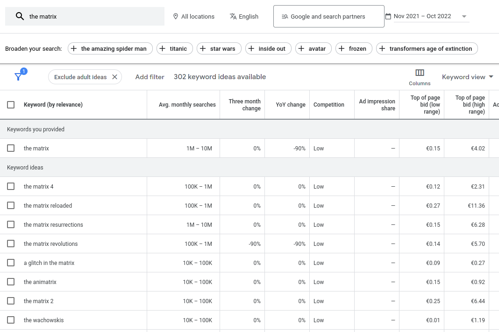
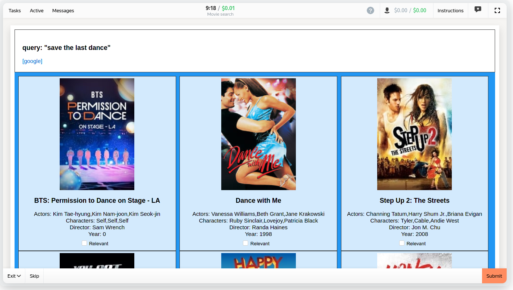
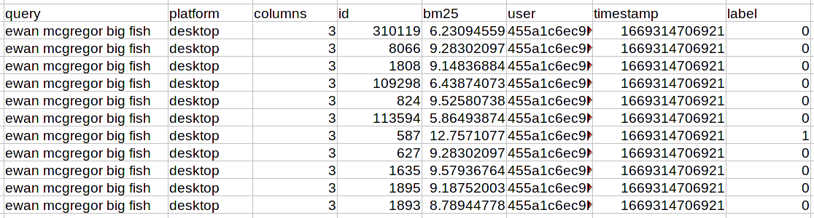

# MSRD: Movie Search Ranking Dataset

This is a Movielens/TMDB-based dataset for search relevance optimization. It contains:
* Movie metadata from TMDB/Movielens: title, description, actors, genres, characters, tags, dates, budget, votes.
* 28320 movie related search queries collected with [Google Keyword Planner](https://ads.google.com/home/tools/keyword-planner/).
* User metadata: mobile/desktop platform and number of columns in the UI.
* ~380k relevance labels made by ~1000 people, with corresponding BM25 scores.

Dataset is built using [toloka.ai](https://toloka.ai) platform by humans and contains no synthetic data.

Compared to other relevance-focused datasets like Amazon's [ESCI](https://github.com/amazon-science/esci-data), the MSRD is focused on metadata, and not only on text matching:
* Movies have textual, categorical and numerical features.
* Users also have mobile/desktop labels.


## Contents

* the actual dataset is located in the [dataset](https://github.com/metarank/msrd/tree/master/dataset) directory.
* `movies.csv.gz` is a tab-delimited movie metadata, with TMDB movie ids.
* `queries.csv.gz` is a tab-delimited relevance judgements.

Source data is anonymized and contains only abstract random user identifiers.

### Movie metadata

Movie metadata file is a tab-separated CSV file with the following fields:

```
"id": 603
"title": "The Matrix"
"overview": "Set in the 22nd century, The Matrix tells the story of a computer hacker who joins a group of underground insurgents fighting the vast and powerful computers who now rule the earth."
"tags": "sci-fi,virtual reality,dystopia,philosophy,cyberpunk,artificial intelligence,thought-provoking,alternate reality,martial arts,action"
"genres": "action,sci-fi,thriller"
"director": "Lilly Wachowski"
"actors": "Keanu Reeves,Laurence Fishburne,Robert Taylor,Hugo Weaving,Carrie-Anne Moss,Joe Pantoliano,Rana Morrison,Marcus Chong,Ada Nicodemou,Gloria Foster"
"characters": "Thomas A. Anderson / Neo,Morpheus,Agent Jones,Agent Smith,Trinity,Cypher,Shaylea,Tank,DuJour,Oracle"
"year": 1999
"votes": 22351
"rating": 8.193
"popularity": 60.561
"budget": 63000000
"poster_url": "https://image.tmdb.org/t/p/w154/f89U3ADr1oiB1s9GkdPOEpXUk5H.jpg"
```

Fields `actors`, `characters`, `tags` and `genres` are comma-separated.

### Queries

Queries for this dataset were sourced using a Google Keyword Planner tool with the following process:
* for top-1000 movies (by number of votes) a dataset of reference `$movie.title movie` was generated. For example, "the matrix movie".
* [GKP](https://ads.google.com/home/tools/keyword-planner/) was used to generate all similar queries to each reference one.
* Only queries with more than 5K monthly searches were kept.



### Labels

[Toloka.ai](https://toloka.ai) platform was used for crowd-sourced relevance labeling. Each labeling task had:
* search query
* top-24 movies matching this search query over `title`, `overview`, `tags`, `genres`, `director`, `actors`, `characters`, `year` fields.
* search results ordering was randomized to avoid position introducing position bias.
* Lucene's EnglishAnalyzer was used to compute the final BM25 score.

As crowdsourced data often has data quality issues, we performed the following set of common actions to improve it:
* Labeler must pass a training and an exam to get access to the real data.
* We computed a distribution of time spent on a task on a test dataset, and blocked all labelers going too fast on a production dataset.
* Due to results shuffling, relevant document can be on any position, so we removed all inputs from labelers with non-even click position distributions (e.g. when you always click on 3rd element for each query you see).



An example how labels looks like is below:



## License

* the dataset is shared under the [CC-BY-SA 4.0 license](LICENSE.md)